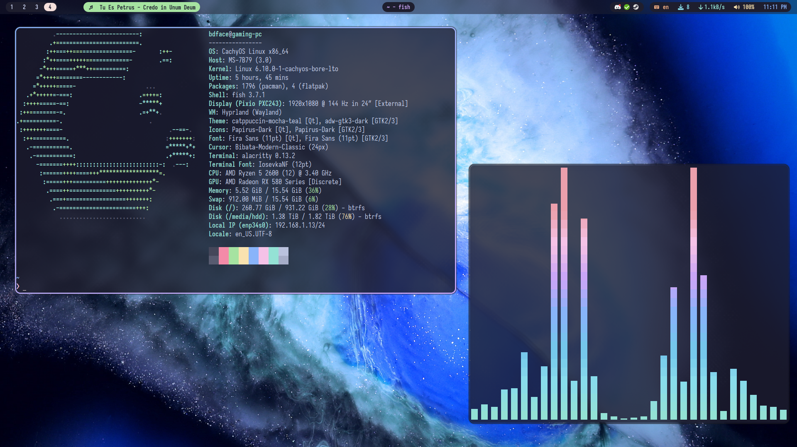
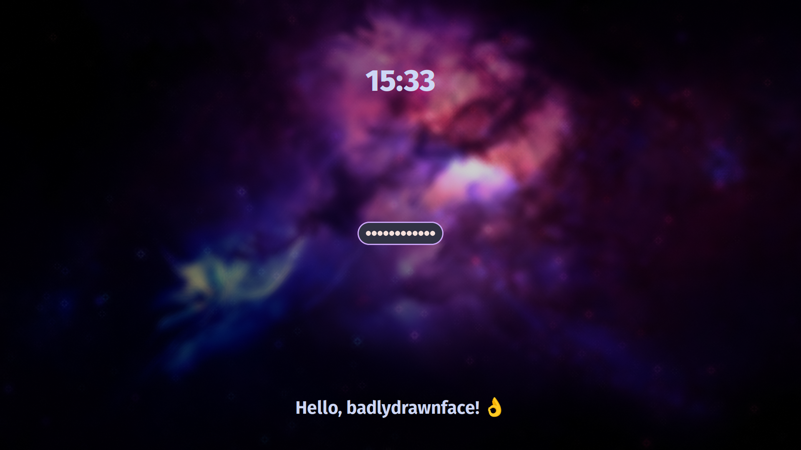

# bdface's dotfiles

some dotfile configurations i use for hyprland and a couple other programs i suppose

just copy the dots to .config and .local respectively, and make sure these programs are installed on your system!

`cp -r config/* ~/.config`

🖥️ wm: [hyprland](https://hyprland.org) 
status bar: [waybar](https://github.com/Alexays/Waybar) 
**</>** terminal: [alacritty](https://alacritty.org) 
🔊 audio visualizer: [cava](https://github.com/karlstav/cava) 
🔒 lockscreen: [hyprlock](https://github.com/hyprwm/hyprlock/) 
🚀 launcher: [rofi (lbonn wayland fork)](https://github.com/lbonn/rofi) + [rofi-emoji](https://github.com/Mange/rofi-emoji) 
📷 screenshot: [grim](https://github.com/emersion/grim) + [slurp](https://github.com/emersion/slurp) + [swappy](https://github.com/jtheoof/swappy) 
💬 notifications: [mako](https://github.com/emersion/mako) 
👋 logout screen: [wlogout](https://github.com/ArtsyMacaw/wlogout) 

###### Desktop [(wallpaper)](https://wallhaven.cc/w/83ox2k)

###### Lockscreen [(wallpaper)](https://wallhaven.cc/w/nml81k)

