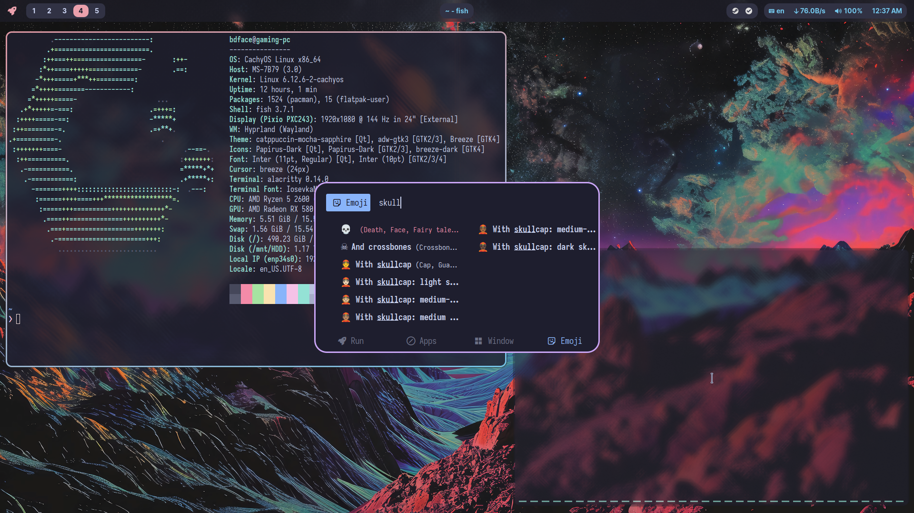
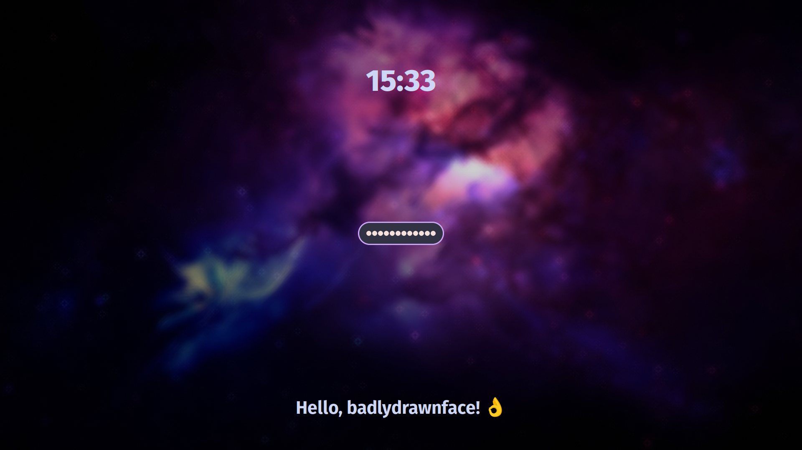

# bdface's dotfiles

Some dotfile configurations i use for hyprland and a couple other programs that I use.

These are only tested on arch-based systems, use with other distros (and in general) at your own risk. I am not consistantly maintaining these.

Just copy the dots to `.config` and `.local` in your home directory respectively, and make sure these programs are installed on your system!

`cp -r config/* ~/.config` 
`cp -r local/* ~/.local/`

🖥️ wm: [hyprland](https://hyprland.org) 
status bar: [waybar](https://github.com/Alexays/Waybar) 
**</>** terminal: [alacritty](https://alacritty.org) 
🔊 audio visualizer: [cava](https://github.com/karlstav/cava) 
🔒 lockscreen: [hyprlock](https://github.com/hyprwm/hyprlock/) 
🚀 launcher: [rofi (lbonn wayland fork)](https://github.com/lbonn/rofi) + [rofi-emoji](https://github.com/Mange/rofi-emoji) 
📷 screenshot: [grimblast](https://github.com/hyprwm/contrib) 
💬 notifications: [dunst](https://github.com/dunst-project/dunst) 

###### Desktop [(wallpaper)](https://wallhaven.cc/w/yxdrex)

###### Lockscreen [(wallpaper)](https://wallhaven.cc/w/nml81k)

